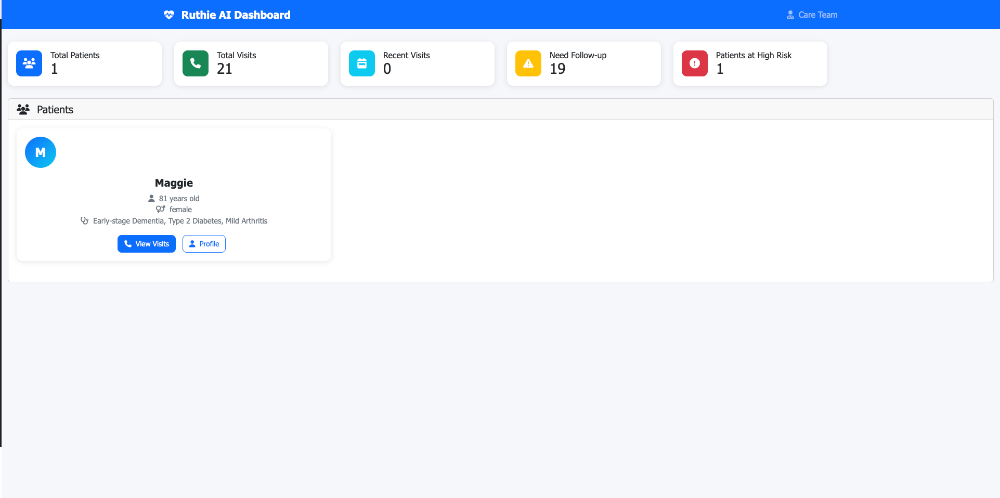
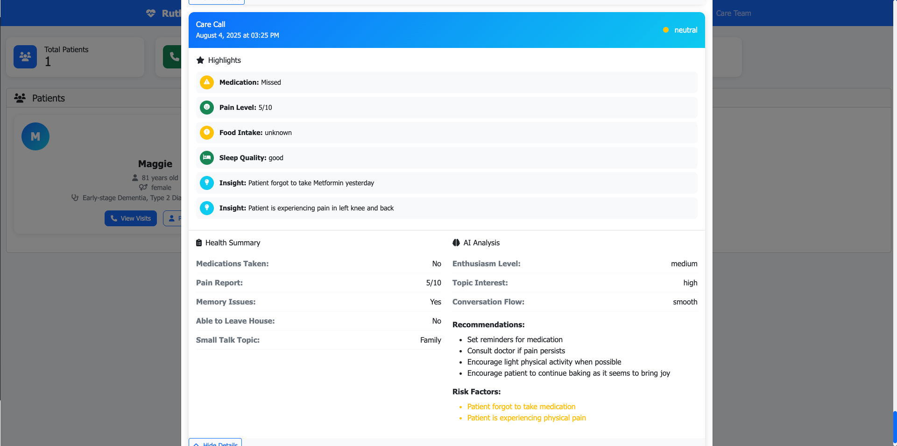
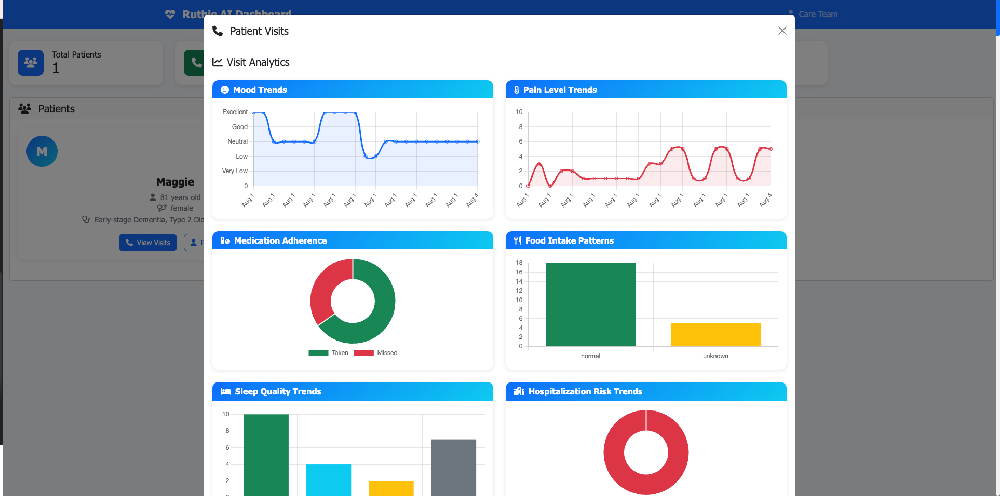
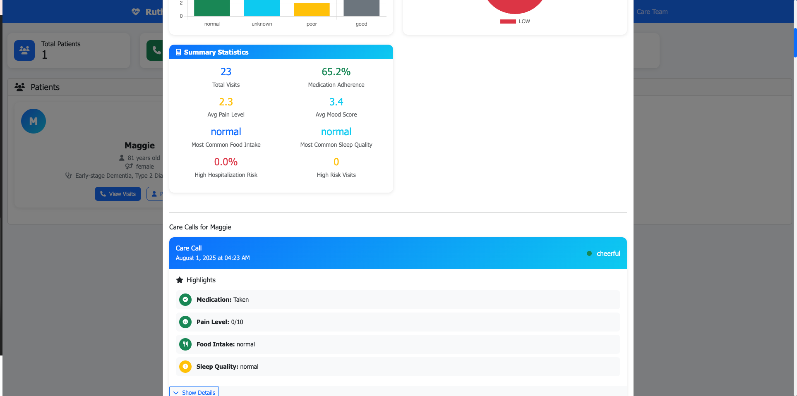

# Ruthie AI - Patient Care Companion

**AI-powered care companion that makes personalized wellness check-in calls to elderly patients, analyzes conversations for health insights, and provides predictive healthcare monitoring through an interactive dashboard.**



## 🎯 **The Problem**

Elderly care faces critical challenges:
- **Caregiver Shortage**: Limited staff to provide consistent monitoring
- **Patient Isolation**: Elderly patients often feel lonely and disconnected
- **Reactive Care**: Health issues are often detected too late
- **Data Gaps**: Lack of comprehensive health trend analysis
- **Resource Strain**: Healthcare systems struggle with growing elderly population

## 💡 **Our Solution**

Ruthie AI is an intelligent voice AI agent that transforms elderly care through:

### 🤖 **Personalized AI Care Calls**
- **Natural Conversations**: Warm, empathetic phone calls that feel human
- **Health Monitoring**: Comprehensive wellness check-ins covering medication, pain, mood, and daily activities
- **Context-Aware**: Remembers patient preferences and builds on previous conversations
- **Predictive Healthcare**: Identifies hospitalization risk factors before they become emergencies

### 📊 **Intelligent Health Analytics**
- **Real-time Insights**: AI-powered analysis of every conversation
- **Health Trends**: Track mood, pain levels, medication adherence over time
- **Risk Assessment**: Automated detection of health concerns requiring attention
- **Actionable Recommendations**: Specific care suggestions for caregivers

### 🏥 **Modern Care Dashboard**
- **Patient Overview**: Comprehensive view of all patients and their health status
- **Visit History**: Detailed records of every care call with key insights
- **Analytics**: Interactive charts showing health trends and patterns
- **Risk Monitoring**: Real-time alerts for patients needing immediate attention

## 🚀 **How It Works**

### 1. **Personalized Care Call**
Ruthie initiates a natural phone conversation with each patient, asking about their health, mood, and daily activities while engaging in meaningful small talk about their interests.



### 2. **Intelligent Analysis**
Every conversation is analyzed using OpenAI GPT-4 to extract health insights, identify risk factors, and generate care recommendations.

### 3. **Predictive Healthcare**
Our machine learning model predicts hospitalization risk based on conversation data and patient history, enabling proactive care.

### 4. **Actionable Insights**
Caregivers receive comprehensive reports with specific recommendations for each patient through an intuitive dashboard.



## 📈 **Business Impact**

### **For Healthcare Providers**
- **Reduce Hospitalizations**: Early detection prevents costly emergency admissions
- **Improve Care Quality**: Data-driven insights lead to better patient outcomes
- **Increase Efficiency**: Automated monitoring frees up staff for hands-on care
- **Scale Operations**: Handle more patients without proportional staff increases

### **For Patients**
- **Better Health Outcomes**: Proactive care prevents health deterioration
- **Reduced Isolation**: Regular check-ins provide social connection
- **Personalized Care**: Tailored conversations based on individual needs
- **Peace of Mind**: Consistent monitoring gives families confidence

### **For Caregivers**
- **Comprehensive Monitoring**: Real-time visibility into patient health
- **Actionable Data**: Clear recommendations for care decisions
- **Time Savings**: Automated routine check-ins
- **Better Communication**: Structured data for family updates

## 🛠️ **Technology Stack**

- **Voice AI**: VAPI platform for natural phone conversations
- **AI Analysis**: OpenAI GPT-4 for intelligent conversation analysis
- **Predictive ML**: Custom hospitalization risk prediction model (see installation instructions)
- **Data Storage**: MongoDB for secure patient data management
- **Dashboard**: Modern web interface with real-time analytics
- **Integration**: RESTful APIs for healthcare system connectivity

## 📊 **Key Features**

### **Smart Conversation AI**
- Natural, empathetic voice interactions
- Context-aware conversations that build on previous visits
- Dynamic topic selection based on patient interests
- Automatic health assessment during casual conversation

### **Comprehensive Health Monitoring**
- Medication adherence tracking
- Pain level assessment (0-10 scale)
- Mood and cognitive status evaluation
- Food intake and sleep quality monitoring
- Mobility and independence assessment

### **Predictive Analytics**
- Hospitalization risk prediction with confidence scoring
- Health trend analysis over time
- Early warning system for health deterioration
- Personalized risk factor identification

### **Modern Dashboard**
- Real-time patient overview and statistics
- Interactive health trend visualizations
- Detailed visit history with AI insights
- Risk assessment and alert system



## 🚀 **Getting Started**

### **Prerequisites**
- Python 3.8+
- MongoDB Atlas account
- VAPI API key
- OpenAI API key

### **Installation**

1. **Clone the repository**
   ```bash
   git clone https://github.com/yourusername/ruthie-ai.git
   cd ruthie-ai
   ```

2. **Install dependencies**
   ```bash
   pip install -r requirements.txt
   ```

3. **Configure environment variables**
   Create a `.env` file with your API keys:
   ```bash
   # Copy the example environment file
   cp env.example .env
   ```
   
   Then edit `.env` and replace the placeholder values with your actual credentials:
   ```env
   MONGODB_ATLAS_URI=your_mongodb_connection_string
   VAPI_API_KEY=your_vapi_api_key
   VAPI_PHONE_NUMBER_ID=your_vapi_phone_number_id
   OPENAI_API_KEY=your_openai_api_key
   ```

4. **Download the Hospitalization Prediction Model**
   
   The hospitalization prediction model file (`prevention_model/hospitalization_model.pkl`) is not included in this repository due to size limitations. You have two options:
   
   **Option A: Download from Release Assets**
   - Go to the [Releases](https://github.com/yourusername/ruthie-ai/releases) page
   - Download `hospitalization_model.pkl` from the latest release
   - Place it in the `prevention_model/` directory
   
   **Option B: Train Your Own Model**
   - Use the Jupyter notebook in `prevention_model/model.ipynb`
   - Follow the training instructions to create your own model
   - Save the trained model as `prevention_model/hospitalization_model.pkl`
   
   **Option C: Run Without Prediction Model**
   - The system will work without the model, but hospitalization risk prediction will be disabled
   - All other features (calls, analysis, dashboard) will function normally

5. **Run the complete pipeline**
   ```bash
   python complete_pipeline.py
   ```

6. **Launch the dashboard**
   ```bash
   cd dashboard
   python app.py
   ```
   Access the dashboard at: `http://localhost:5001`

## 📋 **Usage Examples**

### **Making a Care Call**
```python
from complete_pipeline import run_ruthie_care_call

# Initiate a care call for a patient
results = run_ruthie_care_call(
    patient_id="patient_id_here",
    phone_number="+1234567890",
    max_wait_minutes=15
)

if results["success"]:
    print(f"Call completed successfully!")
    print(f"Patient Mood: {results['analysis']['mood']}")
    print(f"Risk Level: {results['analysis']['hospitalizationPrediction']['riskLevel']}")
```

### **Viewing Dashboard Analytics**
1. Open the dashboard in your browser
2. View patient overview and statistics
3. Click on any patient to see their visit history
4. Explore health trends and risk assessments
5. Review AI-generated insights and recommendations

## 🎯 **Use Cases**

### **Home Healthcare**
- **Daily Wellness Checks**: Regular monitoring for homebound patients
- **Medication Reminders**: Ensure medication adherence
- **Family Updates**: Keep families informed about patient status
- **Emergency Detection**: Early warning for health emergencies

### **Senior Living Communities**
- **Population Health**: Monitor health trends across communities
- **Staff Support**: Augment care staff with AI assistance
- **Quality Metrics**: Track care quality and outcomes
- **Resource Planning**: Optimize care allocation

### **Healthcare Systems**
- **Readmission Prevention**: Reduce hospital readmissions
- **Population Health**: Monitor high-risk patient populations
- **Care Coordination**: Improve communication between care teams
- **Quality Improvement**: Data-driven care optimization

## 🔒 **Security & Privacy**

- **HIPAA Compliant**: Designed with healthcare privacy requirements
- **Data Encryption**: All data encrypted in transit and at rest
- **Access Control**: Role-based permissions for data access
- **Audit Trails**: Complete logging of all data access and changes
- **Secure APIs**: Industry-standard authentication and authorization

## 🚀 **Deployment**

### **Local Development**
```bash
# Run complete system locally
python complete_pipeline.py
cd dashboard && python app.py
```

## 🏆 **Acknowledgments**

- **VAPI**: Voice AI platform for natural conversations
- **OpenAI**: Advanced language processing capabilities
- **MongoDB**: Reliable data storage and management
- **Healthcare Community**: Valuable feedback and insights

---

**Ruthie AI** - Making elderly care more intelligent, compassionate, and effective! 🏥🤖💙

*Transform how we care for our elderly population with AI-powered, personalized healthcare monitoring.* # ruthieAI
